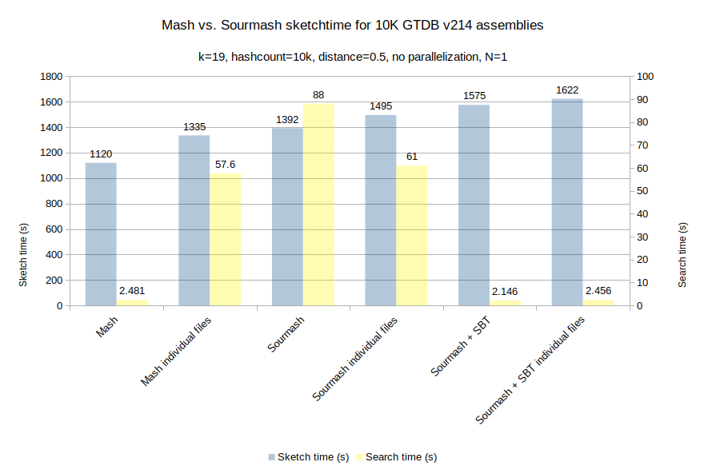

# Benchmarking mash vs. sourmash

A quick and dirty benchmark to see if performance is comparable between the two programs.

These tests are not at all statistically meaningful; n=1 in all cases.

Run using Sean J.'s download of GTDB v214.

## Summary graphs




## Data setup

```
gaprice@perlmutter:login10:/global/cfs/cdirs/kbase/jungbluth/Projects/Project_Pangenome_GTDB/GTDB_v214_download/ftp.ncbi.nlm.nih.gov/genomes/all> ipython
Python 3.9.7 (default, Sep 16 2021, 13:09:58) 
Type 'copyright', 'credits' or 'license' for more information
IPython 7.31.1 -- An enhanced Interactive Python. Type '?' for help.

In [1]: files = !head -n 10000 t

In [2]: len(files)
Out[2]: 10000

In [3]: files[0]
Out[3]: './GCA/018/630/415/GCA_018630415.1_ASM1863041v1/GCA_018630415.1_ASM1863041v1_genomic.fna.gz'

In [4]: root = !pwd

In [5]: root = root[0]

In [6]: root
Out[6]: '/global/cfs/cdirs/kbase/jungbluth/Projects/Project_Pangenome_GTDB/GTDB_v214_download/ftp.ncbi.nlm.nih.gov/genomes/all'

In [7]: with open("/global/homes/g/gaprice/mash/GTDB_v214_SeanJ_first10k.txt", "w") as out:
   ...:     for f in files:
   ...:         out.write(f"{root}/{f}\n")
   ...: 

In [8]: exit
gaprice@perlmutter:login10:/global/cfs/cdirs/kbase/jungbluth/Projects/Project_Pangenome_GTDB/GTDB_v214_download/ftp.ncbi.nlm.nih.gov/genomes/all> cd ~/mash/
gaprice@perlmutter:login10:~/mash> wc -l GTDB_v214_SeanJ_first10k.txt 
10000 GTDB_v214_SeanJ_first10k.txt
gaprice@perlmutter:login10:~/mash> head -n 1 GTDB_v214_SeanJ_first10k.txt 
/global/cfs/cdirs/kbase/jungbluth/Projects/Project_Pangenome_GTDB/GTDB_v214_download/ftp.ncbi.nlm.nih.gov/genomes/all/./GCA/018/630/415/GCA_018630415.1_ASM1863041v1/GCA_018630415.1_ASM1863041v1_genomic.fna.gz
```

## Versions

### mash
```
gaprice@perlmutter:login10:~/mash> /global/homes/g/gaprice/mash/mash-Linux64-v2.3/mash -h | head -n 2

Mash version 2.3
```

### sourmash
```
gaprice@perlmutter:login10:~/mash> sourmash info

== This is sourmash version 4.8.2. ==
== Please cite Brown and Irber (2016), doi:10.21105/joss.00027. ==

sourmash version 4.8.2
- loaded from path: /global/homes/g/gaprice/.local/perlmutter/3.9-anaconda-2021.11/lib/python3.9/site-packages/sourmash/cli
```

## mash sketch of 10k assemblies

### No parallelization

```
gaprice@perlmutter:login10:~/mash> time /global/homes/g/gaprice/mash/mash-Linux64-v2.3/mash sketch -o GTDB_v214_10k.sketch.msh -k 19 -s 10000 -l GTDB_v214_SeanJ_first10k.txt 2> /dev/null

real	18m40.881s
user	15m4.451s
sys	0m6.146s
```
### 4x parallelization

```
gaprice@perlmutter:login10:~/mash> time /global/homes/g/gaprice/mash/mash-Linux64-v2.3/mash sketch -p 4 -o GTDB_v214_10k.sketch.msh -k 19 -s 10000 -l GTDB_v214_SeanJ_first10k.txt 2> /dev/null

real	4m36.456s
user	15m8.595s
sys	0m7.809s
```
## sourmash sketch of 10k assemblies

sourmash does not have built in parallelization.

```
gaprice@perlmutter:login10:~/mash/sourmash> time sourmash sketch dna --from-file ../GTDB_v214_SeanJ_first10k.txt -p k=19,num=10000 -o sketches.zip 2> /dev/null

real	23m12.705s
user	20m17.925s
sys	0m7.090s
```
## mash search of 10k assemblies

Create the query sketch

```
gaprice@perlmutter:login10:~/mash> INPUT=$(head -n 1 GTDB_v214_SeanJ_first10k.txt)
gaprice@perlmutter:login10:~/mash> time /global/homes/g/gaprice/mash/mash-Linux64-v2.3/mash sketch -o GCA_018630415.1_ASM1863041v1_genomic.fna.msh -k 19 -s 10000 $INPUT 
Sketching /global/cfs/cdirs/kbase/jungbluth/Projects/Project_Pangenome_GTDB/GTDB_v214_download/ftp.ncbi.nlm.nih.gov/genomes/all/./GCA/018/630/415/GCA_018630415.1_ASM1863041v1/GCA_018630415.1_ASM1863041v1_genomic.fna.gz...
Writing to GCA_018630415.1_ASM1863041v1_genomic.fna.msh...

real	0m0.111s
user	0m0.102s
sys	0m0.009s
```
Search:

```
gaprice@perlmutter:login10:~/mash> time /global/homes/g/gaprice/mash/mash-Linux64-v2.3/mash dist -d 0.5 GCA_018630415.1_ASM1863041v1_genomic.fna.msh GTDB_v214_10k.sketch.msh > GTDB_v214_10k.sketch.msh.out

real	0m2.481s
user	0m1.859s
sys	0m0.632s

gaprice@perlmutter:login10:~/mash> wc -l GTDB_v214_10k.sketch.msh.out 
4448 GTDB_v214_10k.sketch.msh.out
```

## sourmash search of 10k assemblies

Create the query sketch

```
gaprice@perlmutter:login10:~/mash/sourmash> INPUT=$(head -n 1 ../GTDB_v214_SeanJ_first10k.txt)
gaprice@perlmutter:login10:~/mash/sourmash> time sourmash sketch dna -p k=19,num=10000 $INPUT

== This is sourmash version 4.8.2. ==
== Please cite Brown and Irber (2016), doi:10.21105/joss.00027. ==

computing signatures for files: /global/cfs/cdirs/kbase/jungbluth/Projects/Project_Pangenome_GTDB/GTDB_v214_download/ftp.ncbi.nlm.nih.gov/genomes/all/./GCA/018/630/415/GCA_018630415.1_ASM1863041v1/GCA_018630415.1_ASM1863041v1_genomic.fna.gz
Computing a total of 1 signature(s) for each input.
... reading sequences from /global/cfs/cdirs/kbase/jungbluth/Projects/Project_Pangenome_GTDB/GTDB_v214_download/ftp.ncbi.nlm.nih.gov/genomes/all/./GCA/018/630/415/GCA_018630415.1_ASM1863041v1/GCA_018630415.1_ASM1863041v1_genomic.fna.gz
.../global/cfs/cdirs/kbase/jungbluth/Projects/Project_Pangenome_GTDB/GTDB_v214_download/ftp.ncbi.nlm.nih.gov/genomes/all/./GCA/018/630/415/GCA_0calculated 1 signatures for 33 sequences in /global/cfs/cdirs/kbase/jungbluth/Projects/Project_Pangenome_GTDB/GTDB_v214_download/ftp.ncbi.nlm.nih.gov/genomes/all/./GCA/018/630/415/GCA_018630415.1_ASM1863041v1/GCA_018630415.1_ASM1863041v1_genomic.fna.gz
saved 1 signature(s) to 'GCA_018630415.1_ASM1863041v1_genomic.fna.gz.sig'. Note: signature license is CC0.

real	0m0.638s
user	0m0.475s
sys	0m0.160s
```

Search:

```
gaprice@perlmutter:login10:~/mash/sourmash> time sourmash search -t 0.5 -n 0 GCA_018630415.1_ASM1863041v1_genomic.fna.gz.sig sketches.zip

== This is sourmash version 4.8.2. ==
== Please cite Brown and Irber (2016), doi:10.21105/joss.00027. ==

select query k=19 automatically.
loaded query: /global/cfs/cdirs/kbase/jungbl... (k=19, DNA)
--
loaded 10000 total signatures from 1 locations.
after selecting signatures compatible with search, 10000 remain.

28 matches above threshold 0.500:
similarity   match
----------   -----
100.0%       ..._ASM1863041v1/GCA_018630415.1_ASM1863041v1_genomic.fna.gz
 95.9%       ..._ASM1861646v1/GCA_018616465.1_ASM1861646v1_genomic.fna.gz
 95.5%       ..._ASM1829224v1/GCA_018292245.1_ASM1829224v1_genomic.fna.gz
 94.2%       ..._ASM1861640v1/GCA_018616405.1_ASM1861640v1_genomic.fna.gz
 94.1%       ..._ASM1829222v1/GCA_018292225.1_ASM1829222v1_genomic.fna.gz
 59.9%       ..._ASM1484415v1/GCA_014844155.1_ASM1484415v1_genomic.fna.gz
 54.3%       ..._ASM1861649v1/GCA_018616495.1_ASM1861649v1_genomic.fna.gz
 54.2%       ..._ASM1863039v1/GCA_018630395.1_ASM1863039v1_genomic.fna.gz
 52.8%       ..._ASM1837469v1/GCA_018374695.1_ASM1837469v1_genomic.fna.gz
 52.7%       ..._ASM1837717v1/GCA_018377175.1_ASM1837717v1_genomic.fna.gz
 51.6%       ..._ASM1433619v1/GCA_014336195.1_ASM1433619v1_genomic.fna.gz
 51.6%       ..._ASM1433633v1/GCA_014336335.1_ASM1433633v1_genomic.fna.gz
 51.6%       ..._ASM1433650v1/GCA_014336505.1_ASM1433650v1_genomic.fna.gz
 51.6%       ..._ASM1861643v1/GCA_018616435.1_ASM1861643v1_genomic.fna.gz
 51.5%       ..._ASM1836565v1/GCA_018365655.1_ASM1836565v1_genomic.fna.gz
 51.5%       ..._ASM1435312v1/GCA_014353125.1_ASM1435312v1_genomic.fna.gz
 51.2%       ..._ASM1435325v1/GCA_014353255.1_ASM1435325v1_genomic.fna.gz
 51.2%       ..._ASM1861653v1/GCA_018616535.1_ASM1861653v1_genomic.fna.gz
 51.1%       ..._ASM1435351v1/GCA_014353515.1_ASM1435351v1_genomic.fna.gz
 51.1%       ....1_ASM276117v1/GCA_002761175.1_ASM276117v1_genomic.fna.gz
 51.0%       ..._ASM1863042v1/GCA_018630425.1_ASM1863042v1_genomic.fna.gz
 50.9%       ..._ASM1433526v1/GCA_014335265.1_ASM1433526v1_genomic.fna.gz
 50.9%       ..._ASM1433711v1/GCA_014337115.1_ASM1433711v1_genomic.fna.gz
 50.8%       ..._ASM1435359v1/GCA_014353595.1_ASM1435359v1_genomic.fna.gz
 50.8%       ..._ASM1435353v1/GCA_014353535.1_ASM1435353v1_genomic.fna.gz
 50.7%       ..._ASM1435361v1/GCA_014353615.1_ASM1435361v1_genomic.fna.gz
 50.3%       ..._ASM1829226v1/GCA_018292265.1_ASM1829226v1_genomic.fna.gz
 50.3%       ..._ASM1479284v1/GCA_014792845.1_ASM1479284v1_genomic.fna.gz

real	1m28.018s
user	1m27.627s
sys	0m0.388s
```

## Summary

### Sketch

`Mash`: real 18m40.881s  
`Sourmash`: real	23m12.705s

Fairly comparable.

### Search

`Mash`: real	0m2.481s  
`Sourmash`: real  1m28.018s

Assuming this is correct, Sourmash is 35x slower than Mash.

### Results

`Mash`: 4448  
`Sourmash`: 28

Again if this is correct, Sourmash seems to have a very large number of false negatives (or vice
versa)

## Other sourmash experiments

### Test with individual sketches vs. zipped sketches

Create sketches

```
gaprice@perlmutter:login27:~/mash/sourmash/individual> time sourmash sketch dna --from-file ../../GTDB_v214_SeanJ_first10k.txt -p k=19,num=10000 2> /dev/null

real	24m55.665s
user	21m4.174s
sys	0m7.589s
gaprice@perlmutter:login27:~/mash/sourmash/individual> ls | wc -l
10000
```

Sketch time is about the same as with zipping

Query against individual sketches

```
gaprice@perlmutter:login27:~/mash/sourmash/individual> time sourmash search -t 0.5 -n 0 ../GCA_018630415.1_ASM1863041v1_genomic.fna.gz.sig *.sig

== This is sourmash version 4.8.2. ==
== Please cite Brown and Irber (2016), doi:10.21105/joss.00027. ==

select query k=19 automatically.
loaded query: /global/cfs/cdirs/kbase/jungbl... (k=19, DNA)
--
loaded 10000 total signatures from 10000 locations.
after selecting signatures compatible with search, 10000 remain.

28 matches above threshold 0.500:
similarity   match
----------   -----
100.0%       ..._ASM1861645v1/GCA_018616455.1_ASM1861645v1_genomic.fna.gz
 95.9%       ..._ASM1861646v1/GCA_018616465.1_ASM1861646v1_genomic.fna.gz
 95.5%       ..._ASM1829224v1/GCA_018292245.1_ASM1829224v1_genomic.fna.gz
 94.2%       ..._ASM1861640v1/GCA_018616405.1_ASM1861640v1_genomic.fna.gz
 94.1%       ..._ASM1829222v1/GCA_018292225.1_ASM1829222v1_genomic.fna.gz
 59.9%       ..._ASM1484415v1/GCA_014844155.1_ASM1484415v1_genomic.fna.gz
 54.3%       ..._ASM1861649v1/GCA_018616495.1_ASM1861649v1_genomic.fna.gz
 54.2%       ..._ASM1863039v1/GCA_018630395.1_ASM1863039v1_genomic.fna.gz
 52.8%       ..._ASM1837469v1/GCA_018374695.1_ASM1837469v1_genomic.fna.gz
 52.7%       ..._ASM1837717v1/GCA_018377175.1_ASM1837717v1_genomic.fna.gz
 51.6%       ..._ASM1433619v1/GCA_014336195.1_ASM1433619v1_genomic.fna.gz
 51.6%       ..._ASM1433633v1/GCA_014336335.1_ASM1433633v1_genomic.fna.gz
 51.6%       ..._ASM1433650v1/GCA_014336505.1_ASM1433650v1_genomic.fna.gz
 51.6%       ..._ASM1861643v1/GCA_018616435.1_ASM1861643v1_genomic.fna.gz
 51.5%       ..._ASM1435312v1/GCA_014353125.1_ASM1435312v1_genomic.fna.gz
 51.5%       ..._ASM1836565v1/GCA_018365655.1_ASM1836565v1_genomic.fna.gz
 51.2%       ..._ASM1435325v1/GCA_014353255.1_ASM1435325v1_genomic.fna.gz
 51.2%       ..._ASM1861653v1/GCA_018616535.1_ASM1861653v1_genomic.fna.gz
 51.1%       ..._ASM1435351v1/GCA_014353515.1_ASM1435351v1_genomic.fna.gz
 51.1%       ....1_ASM276117v1/GCA_002761175.1_ASM276117v1_genomic.fna.gz
 51.0%       ..._ASM1863042v1/GCA_018630425.1_ASM1863042v1_genomic.fna.gz
 50.9%       ..._ASM1433526v1/GCA_014335265.1_ASM1433526v1_genomic.fna.gz
 50.9%       ..._ASM1433711v1/GCA_014337115.1_ASM1433711v1_genomic.fna.gz
 50.8%       ..._ASM1435353v1/GCA_014353535.1_ASM1435353v1_genomic.fna.gz
 50.8%       ..._ASM1435359v1/GCA_014353595.1_ASM1435359v1_genomic.fna.gz
 50.7%       ..._ASM1435361v1/GCA_014353615.1_ASM1435361v1_genomic.fna.gz
 50.3%       ..._ASM1829226v1/GCA_018292265.1_ASM1829226v1_genomic.fna.gz
 50.3%       ..._ASM1479284v1/GCA_014792845.1_ASM1479284v1_genomic.fna.gz

real	1m1.367s
user	0m49.454s
sys	0m6.910s
```

A bit faster than zipped.

### Test search with an SBT on zipped signatures

Build SBT:

```
gaprice@perlmutter:login27:~/mash/sourmash> time sourmash index sketches sketches.zip

== This is sourmash version 4.8.2. ==
== Please cite Brown and Irber (2016), doi:10.21105/joss.00027. ==

loading 1 files into SBT

loaded 10000 sigs; saving SBT under "sketches"
Finished saving nodes, now saving SBT index file.
Finished saving SBT index, available at /global/u2/g/gaprice/mash/sourmash/sketches.sbt.zip


real	3m3.991s
user	2m41.657s
sys	0m2.012s
```

Search against SBT:

```
gaprice@perlmutter:login27:~/mash/sourmash> time sourmash search -t 0.5 -n 0 GCA_018630415.1_ASM1863041v1_genomic.fna.gz.sig sketches.sbt.zip 

== This is sourmash version 4.8.2. ==
== Please cite Brown and Irber (2016), doi:10.21105/joss.00027. ==

select query k=19 automatically.
loaded query: /global/cfs/cdirs/kbase/jungbl... (k=19, DNA)
--
loaded 10000 total signatures from 1 locations.
after selecting signatures compatible with search, 10000 remain.

28 matches above threshold 0.500:
similarity   match
----------   -----
100.0%       ..._ASM1863041v1/GCA_018630415.1_ASM1863041v1_genomic.fna.gz
 95.9%       ..._ASM1861646v1/GCA_018616465.1_ASM1861646v1_genomic.fna.gz
 95.5%       ..._ASM1829224v1/GCA_018292245.1_ASM1829224v1_genomic.fna.gz
 94.2%       ..._ASM1861640v1/GCA_018616405.1_ASM1861640v1_genomic.fna.gz
 94.1%       ..._ASM1829222v1/GCA_018292225.1_ASM1829222v1_genomic.fna.gz
 59.9%       ..._ASM1484415v1/GCA_014844155.1_ASM1484415v1_genomic.fna.gz
 54.3%       ..._ASM1861649v1/GCA_018616495.1_ASM1861649v1_genomic.fna.gz
 54.2%       ..._ASM1863039v1/GCA_018630395.1_ASM1863039v1_genomic.fna.gz
 52.8%       ..._ASM1837469v1/GCA_018374695.1_ASM1837469v1_genomic.fna.gz
 52.7%       ..._ASM1837717v1/GCA_018377175.1_ASM1837717v1_genomic.fna.gz
 51.6%       ..._ASM1433619v1/GCA_014336195.1_ASM1433619v1_genomic.fna.gz
 51.6%       ..._ASM1433633v1/GCA_014336335.1_ASM1433633v1_genomic.fna.gz
 51.6%       ..._ASM1433650v1/GCA_014336505.1_ASM1433650v1_genomic.fna.gz
 51.6%       ..._ASM1861643v1/GCA_018616435.1_ASM1861643v1_genomic.fna.gz
 51.5%       ..._ASM1435312v1/GCA_014353125.1_ASM1435312v1_genomic.fna.gz
 51.5%       ..._ASM1836565v1/GCA_018365655.1_ASM1836565v1_genomic.fna.gz
 51.2%       ..._ASM1435325v1/GCA_014353255.1_ASM1435325v1_genomic.fna.gz
 51.2%       ..._ASM1861653v1/GCA_018616535.1_ASM1861653v1_genomic.fna.gz
 51.1%       ..._ASM1435351v1/GCA_014353515.1_ASM1435351v1_genomic.fna.gz
 51.1%       ....1_ASM276117v1/GCA_002761175.1_ASM276117v1_genomic.fna.gz
 51.0%       ..._ASM1863042v1/GCA_018630425.1_ASM1863042v1_genomic.fna.gz
 50.9%       ..._ASM1433526v1/GCA_014335265.1_ASM1433526v1_genomic.fna.gz
 50.9%       ..._ASM1433711v1/GCA_014337115.1_ASM1433711v1_genomic.fna.gz
 50.8%       ..._ASM1435359v1/GCA_014353595.1_ASM1435359v1_genomic.fna.gz
 50.8%       ..._ASM1435353v1/GCA_014353535.1_ASM1435353v1_genomic.fna.gz
 50.7%       ..._ASM1435361v1/GCA_014353615.1_ASM1435361v1_genomic.fna.gz
 50.3%       ..._ASM1829226v1/GCA_018292265.1_ASM1829226v1_genomic.fna.gz
 50.3%       ..._ASM1479284v1/GCA_014792845.1_ASM1479284v1_genomic.fna.gz

real	0m2.146s
user	0m1.966s
sys	0m0.172s
```

So +3 mins to build the SBT, but the search is now slightly faster than mash.

Maybe mash is building a bloom filter under the hood?

### Test search with an SBT on unzipped signatures

Build SBT

```
gaprice@perlmutter:login27:~/mash/sourmash/individual> time sourmash index sketches *.sig

== This is sourmash version 4.8.2. ==
== Please cite Brown and Irber (2016), doi:10.21105/joss.00027. ==

loading 10000 files into SBT

loaded 10000 sigs; saving SBT under "sketches"
Finished saving nodes, now saving SBT index file.
Finished saving SBT index, available at /global/u2/g/gaprice/mash/sourmash/individual/sketches.sbt.zip


real	2m7.258s
user	1m43.538s
sys	0m6.697s
```

About 1/3 faster than with zipped sketches.

Search against SBT:

```
gaprice@perlmutter:login27:~/mash/sourmash/individual> time sourmash search -t 0.5 -n 0 ../GCA_018630415.1_ASM1863041v1_genomic.fna.gz.sig sketches.sbt.zip

== This is sourmash version 4.8.2. ==
== Please cite Brown and Irber (2016), doi:10.21105/joss.00027. ==

select query k=19 automatically.
loaded query: /global/cfs/cdirs/kbase/jungbl... (k=19, DNA)
--
loaded 10000 total signatures from 1 locations.
after selecting signatures compatible with search, 10000 remain.

28 matches above threshold 0.500:
similarity   match
----------   -----
100.0%       ..._ASM1863041v1/GCA_018630415.1_ASM1863041v1_genomic.fna.gz
 95.9%       ..._ASM1861646v1/GCA_018616465.1_ASM1861646v1_genomic.fna.gz
 95.5%       ..._ASM1829224v1/GCA_018292245.1_ASM1829224v1_genomic.fna.gz
 94.2%       ..._ASM1861640v1/GCA_018616405.1_ASM1861640v1_genomic.fna.gz
 94.1%       ..._ASM1829222v1/GCA_018292225.1_ASM1829222v1_genomic.fna.gz
 59.9%       ..._ASM1484415v1/GCA_014844155.1_ASM1484415v1_genomic.fna.gz
 54.3%       ..._ASM1861649v1/GCA_018616495.1_ASM1861649v1_genomic.fna.gz
 54.2%       ..._ASM1863039v1/GCA_018630395.1_ASM1863039v1_genomic.fna.gz
 52.8%       ..._ASM1837469v1/GCA_018374695.1_ASM1837469v1_genomic.fna.gz
 52.7%       ..._ASM1837717v1/GCA_018377175.1_ASM1837717v1_genomic.fna.gz
 51.6%       ..._ASM1433619v1/GCA_014336195.1_ASM1433619v1_genomic.fna.gz
 51.6%       ..._ASM1433633v1/GCA_014336335.1_ASM1433633v1_genomic.fna.gz
 51.6%       ..._ASM1433650v1/GCA_014336505.1_ASM1433650v1_genomic.fna.gz
 51.6%       ..._ASM1861643v1/GCA_018616435.1_ASM1861643v1_genomic.fna.gz
 51.5%       ..._ASM1435312v1/GCA_014353125.1_ASM1435312v1_genomic.fna.gz
 51.5%       ..._ASM1836565v1/GCA_018365655.1_ASM1836565v1_genomic.fna.gz
 51.2%       ..._ASM1435325v1/GCA_014353255.1_ASM1435325v1_genomic.fna.gz
 51.2%       ..._ASM1861653v1/GCA_018616535.1_ASM1861653v1_genomic.fna.gz
 51.1%       ..._ASM1435351v1/GCA_014353515.1_ASM1435351v1_genomic.fna.gz
 51.1%       ....1_ASM276117v1/GCA_002761175.1_ASM276117v1_genomic.fna.gz
 51.0%       ..._ASM1863042v1/GCA_018630425.1_ASM1863042v1_genomic.fna.gz
 50.9%       ..._ASM1433711v1/GCA_014337115.1_ASM1433711v1_genomic.fna.gz
 50.9%       ..._ASM1433526v1/GCA_014335265.1_ASM1433526v1_genomic.fna.gz
 50.8%       ..._ASM1435359v1/GCA_014353595.1_ASM1435359v1_genomic.fna.gz
 50.8%       ..._ASM1435353v1/GCA_014353535.1_ASM1435353v1_genomic.fna.gz
 50.7%       ..._ASM1435361v1/GCA_014353615.1_ASM1435361v1_genomic.fna.gz
 50.3%       ..._ASM1829226v1/GCA_018292265.1_ASM1829226v1_genomic.fna.gz
 50.3%       ..._ASM1479284v1/GCA_014792845.1_ASM1479284v1_genomic.fna.gz

real	0m2.456s
user	0m2.246s
sys	0m0.201s
```

Comparable to mash as expected from the previous result. with a +2m penalty to sketch construction

## Other mash experiments

### Sketch individually vs 1 file with 10k sketches

```
gaprice@perlmutter:login27:~/mash/mash/individual> ipython
Python 3.9.7 (default, Sep 16 2021, 13:09:58) 
Type 'copyright', 'credits' or 'license' for more information
IPython 7.31.1 -- An enhanced Interactive Python. Type '?' for help.

In [1]: with open("../../GTDB_v214_SeanJ_first10k.txt") as flist:
   ...:     files = [f for f in flist.read().split("\n") if f]
   ...: 

In [2]: len(files)
Out[2]: 10000

In [3]: import pathlib

In [4]: mash = "/global/homes/g/gaprice/mash/mash-Linux64-v2.3/mash"

In [5]: import subprocess

In [7]: def mashify(mash, files):
   ...:     for f in files:
   ...:         p = pathlib.Path(f)
   ...:         n = p.name
   ...:         subprocess.run([mash, "sketch", "-k", "19", "-s", "10000", "-o",
   ...:  str(n), f])
   ...: 

In [8]: %time mashify(mash, files)
Sketching /global/cfs/cdirs/kbase/jungbluth/Projects/Project_Pangenome_GTDB/GTDB_v214_download/ftp.ncbi.nlm.nih.gov/genomes/all/./GCA/018/630/415/GCA_018630415.1_ASM1863041v1/GCA_018630415.1_ASM1863041v1_genomic.fna.gz...
Writing to GCA_018630415.1_ASM1863041v1_genomic.fna.gz.msh...

*snip*

Sketching /global/cfs/cdirs/kbase/jungbluth/Projects/Project_Pangenome_GTDB/GTDB_v214_download/ftp.ncbi.nlm.nih.gov/genomes/all/./GCA/002/415/565/GCA_002415565.1_ASM241556v1/GCA_002415565.1_ASM241556v1_genomic.fna.gz...
Writing to GCA_002415565.1_ASM241556v1_genomic.fna.gz.msh...
CPU times: user 1.35 s, sys: 20.7 s, total: 22.1 s
Wall time: 22min 15s

In [9]: exit
gaprice@perlmutter:login27:~/mash/mash/individual> ls | wc -l
10000
```

Not a huge amount slower than sketching into a single file, and comparable to sourmash

## Search against 10k individual files vs. 1 large file

```
In [1]: import subprocess

In [2]: mshfiles = !ls

In [3]: mshfiles[0]
Out[3]: 'GCA_002002485.1_ASM200248v1_genomic.fna.gz.msh'

In [4]: mshfiles[-1]
Out[4]: 'GCA_018993265.1_ASM1899326v1_genomic.fna.gz.msh'

In [5]: queryfile = "/global/homes/g/gaprice/mash/GCA_018630415.1_ASM1863041v1_g
   ...: enomic.fna.msh"

In [6]: mash = "/global/homes/g/gaprice/mash/mash-Linux64-v2.3/mash"

In [7]: def search_mash(mash, query, files):
   ...:     ret = []
   ...:     for f in files:
   ...:         proc = subprocess.run([
   ...:             mash,
   ...:             "dist",
   ...:             "-d", "0.5",
   ...:             query,
   ...:             f
   ...:         ],
   ...:             capture_output=True
   ...:         )
   ...:         ret.append((proc.stdout, proc.stderr))
   ...:     return ret
   ...: 

In [8]: %time ret = search_mash(mash, queryfile, mshfiles)
CPU times: user 1.86 s, sys: 10.8 s, total: 12.6 s
Wall time: 57.6 s

In [9]: ret[0]
Out[9]: 
(b'/global/cfs/cdirs/kbase/jungbluth/Projects/Project_Pangenome_GTDB/GTDB_v214_download/ftp.ncbi.nlm.nih.gov/genomes/all/./GCA/018/630/415/GCA_018630415.1_ASM1863041v1/GCA_018630415.1_ASM1863041v1_genomic.fna.gz\t/global/cfs/cdirs/kbase/jungbluth/Projects/Project_Pangenome_GTDB/GTDB_v214_download/ftp.ncbi.nlm.nih.gov/genomes/all/./GCA/002/002/485/GCA_002002485.1_ASM200248v1/GCA_002002485.1_ASM200248v1_genomic.fna.gz\t0.448279\t0.047489\t1/10000\n',
 b'')

In [10]: {r[1] for r in ret}
Out[10]: {b''}

In [12]: ret[1]
Out[12]: (b'', b'')

In [13]: len({r[0] for r in ret}) - 1
Out[13]: 4448
```

Comparable to sourmash w/o a SBT, although a bit faster
