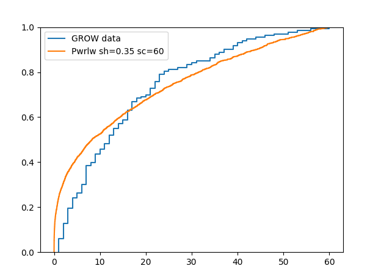
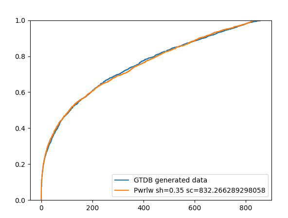

# Sample flattening experiments

## Objective

Create some reasonable test data for GTDB and determine performance for queries where

1. The genome IDs are embedded in the sample document as a list
2. The samples are linked to genomes via edges, necessitating a graph traversal

## Test data creation

### Copy GTDB r214 genomes into a new collection for testing

In the aardvark UI:

```
FOR d IN kbcoll_genome_attribs
    FILTER d.coll == "GTDB"
    FILTER d.load_ver == "r214.kbase.1"
    INSERT d INTO kbcoll_genome_attribs_samples_test
```

Add indexes:

```
$ ipython
Python 3.11.3 (main, Apr  5 2023, 14:14:40) [GCC 7.5.0]
Type 'copyright', 'credits' or 'license' for more information
IPython 8.18.1 -- An enhanced Interactive Python. Type '?' for help.

In [1]: with open("/home/crushingismybusiness/.arangopwdCIcollections_dev") as f
   ...: :
   ...:     arango_pwd = f.read().strip()
   ...: 

In [2]: import aioarango

In [3]: cli = aioarango.ArangoClient(hosts='http://localhost:48000')

In [4]: db = await cli.db("collections_dev", username="collections_dev", passwor
   ...: d=arango_pwd)

In [5]: kg1 = db.collection("kbcoll_genome_attribs")

In [6]: kg2 = db.collection("kbcoll_genome_attribs_samples_test")

In [7]: idx = await kg1.indexes()

In [8]: for i in idx:
   ...:     if i["fields"] != ["_key"]:
   ...:         await kg2.add_persistent_index(i["fields"])
   ...: 

In [9]: 

```

### Generate sample counts and assign genomes to samples

First eyeball fit a power law distribution to the current GROW data. A shape parameter of `0.35`
seemed reasonable

```
In [1]: %matplotlib
Using matplotlib backend: QtAgg

In [2]: from matplotlib import pyplot as plt

In [3]: from scipy import stats

In [4]: import aioarango

In [5]: import time

In [6]: growseed = int(time.time())

In [7]: growseed
Out[7]: 1702946689

In [8]: gtdbseed1 = int(time.time())

In [9]: gtdbseed1
Out[9]: 1702946704

In [10]: gtdbseed2 = int(time.time())

In [11]: gtdbseed2
Out[11]: 1702946717

In [12]: with open("/home/crushingismybusiness/.arangopwdCIcollections_dev") as
    ...: f:
    ...:     arango_pwd = f.read().strip()
    ...: 

In [13]: cli = aioarango.ArangoClient(hosts='http://localhost:48000')

In [14]: db = await cli.db("collections_dev", username="collections_dev", passwo
    ...: rd=arango_pwd)

In [15]: sample_count_aql = """
    ...: FOR d IN kbcoll_samples
    ...:     FILTER d.load_ver == "2023.11"
    ...:     FILTER d.coll == "GROW"
    ...:     COLLECT col = d.coll, lvr = d.load_ver, sid = d.kbase_sample_id WIT
    ...: H COUNT INTO sids
    ...:     RETURN {
    ...:         "coll": col,
    ...:         "load_ver": lvr,
    ...:         "sid": sid,
    ...:         "sids": sids,
    ...:     }
    ...: """

In [16]: samples = []

In [17]: async for d in await db.aql.execute(sample_count_aql):
    ...:     samples.append(d)
    ...: 

In [18]: grow_genomes_per_sample_counts = [s["sids"] for s in samples]

In [19]: min(grow_genomes_per_sample_counts)
Out[19]: 1

In [20]: max(grow_genomes_per_sample_counts)
Out[20]: 60

In [21]: grow_genomes = sum(grow_genomes_per_sample_counts)

In [22]: grow_genomes
Out[22]: 2093

In [23]: grow_samples = len(grow_genomes_per_sample_counts)

In [24]: grow_samples
Out[24]: 133

In [25]: kg2 = db.collection("kbcoll_genome_attribs_samples_test")  # copy of GT
    ...: DB load_ver r214.kbase.1

In [26]: gtdb_genomes = await kg2.count()

In [27]: gtdb_genomes
Out[27]: 402709

In [28]: def add_power_law(plt, shape, size, scale, seed):
    ...:     group_weights = stats.powerlaw.rvs(
    ...:         shape, size=size, scale=scale, random_state=seed
    ...:     )
    ...:     plt.ecdf(group_weights, label=f"Pwrlw sh={shape} sc={scale}")
    ...: 

In [29]: plt.ecdf(grow_genomes_per_sample_counts, label="GROW data")
Out[29]: <matplotlib.lines.Line2D at 0x7f464063ae50>

In [30]: add_power_law(plt, .35, 2000, 60, growseed)

In [31]: plt.legend()
Out[31]: <matplotlib.legend.Legend at 0x7f465164c650>

In [32]: # saved plot and closed plot window
```



Next, continuing on from the prior ipython state, generate the number of samples and their
genome counts, the latter using the power law fit above but scaled up.

```
In [33]: # we want to scale up both the number of samples and the max sample siz
    ...: e, so we scale each by the square root of the genome ratio so the sum w
    ...: eights will come out pretty close to the number of gtdb genomes

In [34]: ratiosqrt = (gtdb_genomes / grow_genomes) ** 0.5

In [35]: ratiosqrt
Out[35]: 13.871104821634301

In [36]: gtdb_sample_count = int(grow_samples * ratiosqrt)

In [37]: gtdb_sample_count
Out[37]: 1844

In [38]: group_weights = stats.powerlaw.rvs(.35, size=gtdb_sample_count, scale=m
    ...: ax(grow_genomes_per_sample_counts) * ratiosqrt, random_state=gtdbseed1)
    ...: 

In [39]: sum(group_weights)
Out[39]: 388482.9837637363

In [40]: min(group_weights)
Out[40]: 1.959251439921767e-05

In [41]: # we want every sample to have >=1 genome

In [42]: sum([1 for x in group_weights if x < 1])
Out[42]: 187

In [43]: group_weights_plus_one = [x + 1 for x in group_weights]

In [44]: gwttl = sum(group_weights_plus_one)

In [45]: gwttl
Out[45]: 390326.9837637363

In [46]: group_size_float = [x * gtdb_genomes / gwttl for x in group_weights_plu
    ...: s_one]

In [47]: sum(group_size_float)
Out[47]: 402709.0000000002

In [48]: group_size_cum = [0]

In [49]: for x in group_size_float:
    ...:     group_size_cum.append(group_size_cum[-1] + x)
    ...: 

In [50]: group_size_cum[-1]
Out[50]: 402709.0000000002

In [51]: group_bounds = [round(x) for x in group_size_cum]

In [52]: group_sizes = [group_bounds[i + 1] - group_bounds[i] for i in range(0,
    ...: len(group_bounds) - 1)]

In [53]: sum(group_sizes)
Out[53]: 402709

In [54]: min(group_sizes)
Out[54]: 1

In [55]: max(group_sizes)
Out[55]: 857

In [56]: len(group_sizes)
Out[56]: 1844

In [57]: plt.ecdf(group_sizes, label="GTDB generated data")
Out[57]: <matplotlib.lines.Line2D at 0x7f46402cc150>

In [58]: add_power_law(plt, .35, gtdb_sample_count, scale=max(grow_genomes_per_s
    ...: ample_counts) * ratiosqrt, seed=gtdbseed2)

In [59]: plt.legend()
Out[59]: <matplotlib.legend.Legend at 0x7f46402e1ad0>
```


