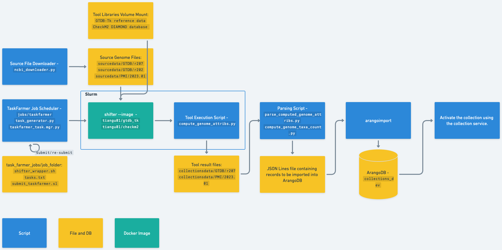

# Generate Genome Collection Data

## Data Workflow


## Generate Genome Attributes

This section describes the steps and scripts used to generate attributes of genomes.
The scripts used in the process are located in the `src/loaders` directory.

1. Retrieve Source Genome Files
    * From NCBI
        * Download the genome files from the NCBI FTP server using the script
          [ncbi_downloader.py](../src/loaders/ncbi_downloader/ncbi_downloader.py).
    * From workspace
        * Download the genome files from workspace using the script
          [workspace_downloader.py](../src/loaders/workspace_downloader/workspace_downloader.py).
        * The downloader also creats a collection & source version and link in data to that collection from the overall workspace
2. Compute Genome Attributes
    * The next step is to execute tools to compute various attributes of the genome using the script
      [compute_genome_attribs.py](../src/loaders/genome_collection/compute_genome_attribs.py).
    * This script currently supports two tools for attribute computation:
      [GTDB-TK](https://ecogenomics.github.io/GTDBTk/index.html)
      and [CheckM2](https://github.com/chklovski/CheckM2)
    * To schedule and execute jobs on NERSC, please refer to the
      section [Run NERSC Taskfarmer jobs](#run-nersc-taskfarmer-jobs) below.
3. Parse Tool Results
    * After the attribute computation tools have been executed, the results need to be parsed and organized
      into a format that is suitable for importing into ArangoDB. This is done using the script
      [parse_tool_results.py](../src/loaders/genome_collection/parse_tool_results.py).
4. Import JSON Format File Into ArangoDB
   ```commandline
   # set up an SSH tunnel (Not required when using an internal KBase machine such as dev03) 
   USER_NAME=user_name  # user name for login1.berkeley.kbase.us
   FORWARD=localhost:48000
   ssh -f -N -L $FORWARD:10.58.1.211:8531 \
    $USER_NAME@login1.berkeley.kbase.us
   
   # execute arangoimport
   PARSED_FILE=json_file_path    # the file path generated by the parsing script
   ARANGO_USER=collections_dev   # arangoDB user name
   ARANGO_PW=arango_password     # arangoDB password
   arangoimport --file $PARSED_FILE \
    --server.endpoint tcp://$FORWARD \
    --server.username $ARANGO_USER \
    --server.password $ARANGO_PW \
    --server.database collections_dev \
    --collection kbcoll_genome_attribs
   ```

Note:

* For usage instructions for each script, please refer to the help option (-h) of the script.
* Default directory layout at NERSC
    * source genome files: `/global/cfs/cdirs/kbase/collections/sourcedata/[kbase_collection]/[load_ver]`
    * collections source genome files: `/global/cfs/cdirs/kbase/collections/collectionssource/[kbase_collection]/[source_ver]`
    * computed genome files: `/global/cfs/cdirs/kbase/collections/collectionsdata/[kbase_collection]/[load_ver]/[tool_name]`
* Under common use, all tools should be run at the same time in the script [parse_tool_results.py](../src/loaders/genome_collection/parse_tool_results.py) so that errors can be handled consistently
    * Running less than a full set of tools is generally for development only
    * It’s safe to run less than a full set of tools if none of the tools in the load set reported any errors

## Generate Genome Taxonomy Ranks

This section outlines the procedures and tools utilized to determine the taxonomic ranks, in order of hierarchy,
for the genome taxa counts.

1. Retrieve Taxonomy File
    * From GTDB
        * Download taxonomy files (e.g. `ar53_taxonomy_r207.tsv`) from [GTDB](https://data.gtdb.ecogenomic.org/)
    * Using computational tools such as GTDB-TK
        * Please refer to the "Generate Genome Attributes" section above and follow the steps 1, 2, 3 as described.
2. Prepare Taxa Count Data
    * Process the file containing taxonomy info by utilizing the script
      [compute_genome_taxa_count.py](../src/loaders/genome_collection/compute_genome_taxa_count.py).
3. Import JSON Format File Into ArangoDB
    * Please refer to step 4 in the "Generate Genome Attributes" section above.
    * NOTE: please make sure to use the collection `kbcoll_taxa_count` instead

## Run NERSC Taskfarmer jobs

1. Log into NERSC Perlmutter node

```commandline
ssh user_name@perlmutter-p1.nersc.gov
```

2. Before executing the jobs, it is necessary to download the libraries essential for tools like GTDB-TK and CheckM2 manually.

   * In case you want to utilize an alternative tooling library, you can download the library and update the global 
   variable that denotes its location, such as `GTDBTK_DATA_PATH` or `CHECKM2_DB` in the 
   [task_generator.py](../src/loaders/jobs/taskfarmer/task_generator.py) file.

   * The default directory at NERSC for libraries is:
   ```text
   /global/cfs/cdirs/kbase/collections/libraries
   ```
   * Guidelines for downloading [GTDB-TK](https://ecogenomics.github.io/GTDBTk/installing/index.html#gtdb-tk-reference-data) reference data:
   ```commandline
   # download the reference data to the default directory at NERSC
   cd /global/cfs/cdirs/kbase/collections/libraries/gtdb_tk
   wget https://data.gtdb.ecogenomic.org/releases/latest/auxillary_files/gtdbtk_v2_data.tar.gz
   wget https://data.ace.uq.edu.au/public/gtdb/data/releases/latest/auxillary_files/gtdbtk_v2_data.tar.gz  (or, mirror)
   tar xvzf gtdbtk_v2_data.tar.gz
   ```
   * Guidelines for downloading [CheckM2](https://github.com/chklovski/CheckM2#database) DIAMOND DB:
   ```commandline
   # download the database to the default directory at NERSC
   checkm2 database --download --path /global/cfs/cdirs/kbase/collections/libraries/CheckM2_database
   ```

3. Go to the collections project directory

```commandline
cd /global/cfs/cdirs/kbase/collections
```

4. generate Taskfarmer job files and submit jobs

```commandline

# example configuration
load_ver=r207
kbase_collection=GTDB
source_data_dir=/global/cfs/cdirs/kbase/collections/sourcedata/GTDB/r207
tool=gtdb_tk

PYTHONPATH=collections python collections/src/loaders/jobs/taskfarmer/task_generator.py  \
    --tool $tool \
    --load_ver $load_ver \
    --kbase_collection $kbase_collection \
    --source_data_dir $source_data_dir \
    --submit_job
```