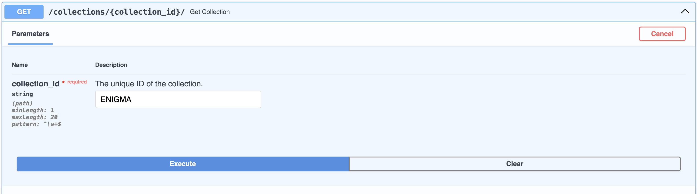

# From KBase Genome to Collection

This guide outlines the process of creating and activating a new collection from KBase narrative with Genome workspace
objects.

Note that for all commands you can run `--help` to get more information about the various CLI options.

## [Step 1: NERSC Account Setup](#step-1-nersc-account-setup)
The commands provided in this document are intended for execution within the terminals of 
[NERSC Perlmutter](https://docs.nersc.gov/systems/perlmutter/). 
If you don't have a NERSC account yet, you can create one via [Iris](https://docs.nersc.gov/iris/).
Before proceeding, please ensure that you have an active NERSC account and are logged in to Perlmutter.

```commandline
ssh perlmutter.nersc.gov
```

## [Step 2: Prepare Source Data Files (FASTA)](#step-2-prepare-source-data-files-fasta)

To run the collections pipeline you will need data uploaded as Genome objects in a KBase Narrative. You can use the Narrative interface to upload data. Additionally, for NCBI data, there are command line based options provided below.

### If you already have a KBase narrative with target Genome objects
If you already possess a KBase narrative containing the desired Genome objects, download the FASTA files associated with
the Genome objects from the KBase workspace to NERSC. The following command facilitates this process:

```commandline
# update arguments as needed
workspace_id=69739
kbase_collection=ENIGMA
source_verion=2023.10
env=CI
token_filepath=path/to/token_file.txt  # This is a single-line file with the KBase token 

cd /global/cfs/cdirs/kbase/collections/collections
PYTHONPATH=. python src/loaders/workspace_downloader/workspace_downloader.py \
    --workspace_id $workspace_id \
    --kbase_collection $kbase_collection \
    --source_ver $source_verion \
    --env $env \
    --token_filepath $token_filepath \
    --retrieve_sample 
```
Please note that the `retrieve_sample` argument is optional and will download the sample data associated with the Genome 
object. If no sample is associated with the Genome object, please remove this argument.

### Create KBase Genome objects from Genbank files
Optionally, you can also download Genbank files from NCBI and create KBase Genome objects from them using the 
following command. This process will also retrieve the FASTA file from the created Genome objects.

```commandline
# update arguments as needed

# download Genbank files from NCBI based on GTDB version
download_file_ext='genomic.gbff.gz'
gtdb_release_ver=214

PYTHONPATH=. python src/loaders/ncbi_downloader/gtdb.py \
    --download_file_ext $download_file_ext \
    --release_ver $gtdb_release_ver
    
# create KBase Genome objects from the downloaded Genbank files
workspace_id=72231
kbase_collection=GTDB
source_verion=$gtdb_release_ver
load_id=1

PYTHONPATH=. python src/loaders/workspace_uploader/workspace_uploader.py \
    --workspace_id $workspace_id \
    --kbase_collection $kbase_collection \
    --source_ver $source_verion \
    --env $env \
    --token_filepath $token_filepath \
    --load_id $load_id  
```

# [Step 3: Execute tools on FASTA files](#step-3-execute-tools-on-fasta-files)

**This step involves submitting jobs to the NERSC Slurm cluster for processing the source data files and will consume 
project NERSC allocation. Please ensure that you have the necessary permissions and resources available before 
executing.**

Once the source data files are prepared, execute tools on these FASTA files. You can choose from various available 
tools such as gtdb_tk, checkm2, microtrait, or mash.


```commandline
# update arguments as needed
tool=gtdb_tk  # available tools: gtdb_tk, checkm2, microtrait, mash
load_ver=$source_verion
source_file_ext=.fa

PYTHONPATH=. python src/loaders/jobs/taskfarmer/task_generator.py \
    --tool $tool \
    --kbase_collection $kbase_collection \
    --source_ver $source_ver \
    --load_ver $load_ver \
    --source_file_ext $source_file_ext \
    --submit_job
```

# [Step 4: Parse and Load Tool Outputs](#step-4-parse-and-load-tool-outputs)


### Parse tool computation results
Parsing tool results for extracting insights from the processed data. This step involves parsing tool computation 
results and genome taxa count information.

```commandline
# Parse tool computation results
PYTHONPATH=. python src/loaders/genome_collection/parse_tool_results.py \
    --kbase_collection $kbase_collection \
    --source_ver $source_ver \
    --load_ver $load_ver \
    --env $env
	
# Parse genome taxa count information
attri_file=${kbase_collection}_${load_ver}_checkm2_gtdb_tk_kbcoll_genome_attribs.jsonl
PYTHONPATH=. python src/loaders/genome_collection/compute_genome_taxa_count.py \
    ../import_files/$env/$kbase_collection/$load_ver/$attri_file \
    --load_ver $load_ver \
    --kbase_collection $kbase_collection \
    --env $env \
    --input_source genome_attributes
```

### Load parsed results to ArangoDB

The output of the parsing script can be imported into ArangoDB. The JSONL result files are found in the directory 
structure: <root_dir>/import_files/<env>/<kbase_collection>/<source_ver>.

All JSONL files in the directory should be imported into the ArangoDB collection. The Arango collection corresponding 
to each JSONL file is derived from the suffix of the file name following `kbcoll`.
For example, `<kbase_collection>_<source_ver>_checkm2_gtdb_tk_kbcoll_genome_attribs.jsonl` will be loaded into the
`kbcoll_genome_attribs` collection.

**Note:** Please update `PARSED_FILE` and `ARANGO_COLL` with the appropriate file path and collection name.
```commandline
# set up an SSH tunnel (Not required when using an internal KBase machine such as dev03) 
USER_NAME=user_name                 # user name for login1.berkeley.kbase.us
FORWARD=localhost:48000
ssh -f -N -L $FORWARD:10.58.1.211:8531 \
 $USER_NAME@login1.berkeley.kbase.us

# execute arangoimport (Please ask system admin for the arangoDB credentials)
PARSED_FILE=json_file_path          # the file path generated by the parsing script
ARANGO_USER=arango_username         # arangoDB user name
ARANGO_PW=arango_password           # arangoDB password
ARANGO_DB=collections_dev           # arangoDB database name
ARANGO_COLL=kbcoll_genome_attribs   # arangoDB collection name

arangoimport --file $PARSED_FILE \
    --server.endpoint tcp://$FORWARD \
    --server.username $ARANGO_USER \
    --server.password $ARANGO_PW \
    --server.database $ARANGO_DB \
    --collection $ARANGO_COLL
```

### Create homology matchers in ArangoDB
For result files, follow the instructions outlined in the 
[Homology Service](https://github.com/jgi-kbase/AssemblyHomologyService) to upload them to the homology server. 
Ensure to utilize the namespace when creating the collection with a homology matcher.

# [Step 5: Create and Active the Collection](#step-5-create-and-active-the-collection)

The Collections endpoint facilitates the creation and activation of collections. Access to the Collections API is 
provided through the Swagger UI, accessible at the KBase_domain/services/collections/docs URL. For instance, 
you can access the Collections API for the CI environment via the following link: [CI Collections API](https://ci.kbase.us/services/collections/docs).

## [5.1: Verify Permissions](#verify-permissions)

Before proceeding with the creation and activation of the collection, it's essential to confirm that you possess 
the requisite permissions.

To verify your permissions, please begin by authorizing with the KBase Token.


Subsequently, execute the `whoami` endpoint.


Example response:
```
{"user":"tgu2","is_service_admin":true}
```
Ensure that the "is_service_admin" field is set to true in the response. If it's false or if you encounter any errors, 
contact system administrator to grant you the necessary permissions.

## [5.2: Create (Save) a New Collection](#create-save-a-new-collection)
The next step is to create a new collection with new or updated data.

### [5.2.1: Retrieve existing collection data](#retrieve-existing-collection-data)
If you're updating an existing collection or uncertain about collection's data structure, you can retrieve the data 
from the currently activated collection by using the `get_collection` endpoint.




**example return**
```commandline
{
  "name": "ENIGMA",
  "ver_src": "2023.11",
  "desc": "Ecosystems and Networks Integrated with Genes and Molecular Assemblies",
  "icon_url": "https://ci.kbase.us/services/shock-api/node/9af1c606-724a-4a63-ab64-8191a89dd462/?download_raw",
  "attribution": "This collection was contributed by the Ecosystems and Networks Integrated with Genes and Molecular Assemblies (ENIGMA) Science Focus Area (SFA). For more details, see [FAIR Narrative doi], and https://www.kbase.us/research/adams-sfa.\nKBase will automatically cite any data from this collection used in a Narrative. If you would like to acknowledge the collection, please copy the text below:\nThe authors would like to acknowledge the KBase collection, ENIGMA, supported by Genomic Science Program, U.S. Department of Energy, Office of Science, Biological and Environmental Research under Contract No. [###], for sharing their data at https://ci-europa.kbase.us/collections/GROW",
  "data_products": [
    {
      "product": "genome_attribs",
      "version": "2023.11",
      "search_view": "genome_attribs_c7a2b9d"
    },
    {
      "product": "microtrait",
      "version": "2023.11",
      "search_view": null
    },
    {
      "product": "samples",
      "version": "2023.11",
      "search_view": "samples_0bd4242"
    },
    {
      "product": "taxa_count",
      "version": "2023.11",
      "search_view": null
    }
  ],
  "matchers": [
    {
      "matcher": "gtdb_lineage",
      "parameters": {
        "gtdb_versions": [
          "214.0",
          "214.1"
        ]
      }
    },
    {
      "matcher": "minhash_homology",
      "parameters": {
        "service_wizard_url": "https://ci.kbase.us/services/service_wizard",
        "sketch_database_name": "Collections_CI_ENIGMA2023_11"
      }
    }
  ],
  "default_select": "genome_attribs",
  "metadata": null,
  "id": "ENIGMA",
  "ver_tag": "2023.11_r9",
  "ver_num": 13,
  "date_create": "2024-01-31T03:22:34.785596+00:00",
  "user_create": "tgu2",
  "date_active": "2024-01-31T03:22:49.149964+00:00",
  "user_active": "tgu2"
}
```


Each collection can have multiple data products, matchers, and other metadata.

- The `data_products` field contains information about the data products associated with the collection. 
  - **product**: Each data product has a `product` field that specifies the product name. Currently, the supported products 
    are `genome_attribs`, `microtrait`, `taxa_count`, `samples` and `biolog`. 
  - **version**: Each product is assigned a version field that indicates the load version of the product. This version 
    corresponds to the load version defined in [Step 3](#step-3-execute-tools-on-fasta-files) above, where tools were 
    executed on the source data files.
  - **search_view**: Each product also includes a `search_view` field, indicating the associated search view. For `microtrait`, 
    `taxa_count`, and `biolog` product, this field should be set to `null`, as the system will automatically retrieve 
    the correct search view. However, for `genome_attribs` and `samples`, it should match the value of the previous 
    `search_view` field. If you've created a new search view with [service_manager](../src/service_manager.py) in 
    ArangoDB, you can specify it here to utilize it for the new collection.

- The `matchers` field contains information about the matchers used for the collection. 

### [5.2.2: Save the New Collection](#save-the-new-collection)
Following that, you can adjust and store the updated collection data, then execute the `save_collection` endpoint by
providing a new version tag.

**Note:** You do not need `id`, `ver_tag`, `ver_num`, `date_create`, `user_create`, `date_active`, and `user_active`
fields in the request body. The system will automatically generate these fields.


## [5.3: Activate The New Collection](#activate-the-new-collection)
There are two ways to activate a collection:

### [Method 1: Activation by Version Tag](#activation-by-version-tag)
You can activate the collection using a specific version tag by executing the `activate_collection_by_ver_num` endpoint.


### [Method 2: Activation by Version Number](#activation-by-version-number)
Alternatively, you can activate the collection by executing the `activate_collection_by_num`  endpoint using its version 
number which is provided by the response of the `Save Collection` endpoint as the `ver_num`.


Now, the new collection is successfully created and activated. You can access and verify the collection data via 
the KBase Collections UI ([CI](https://ci.kbase.us/collections)) or the Collections swagger API 
([CI](https://ci.kbase.us/services/collections/docs)). 